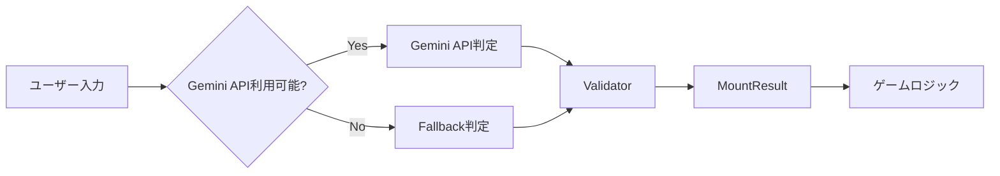
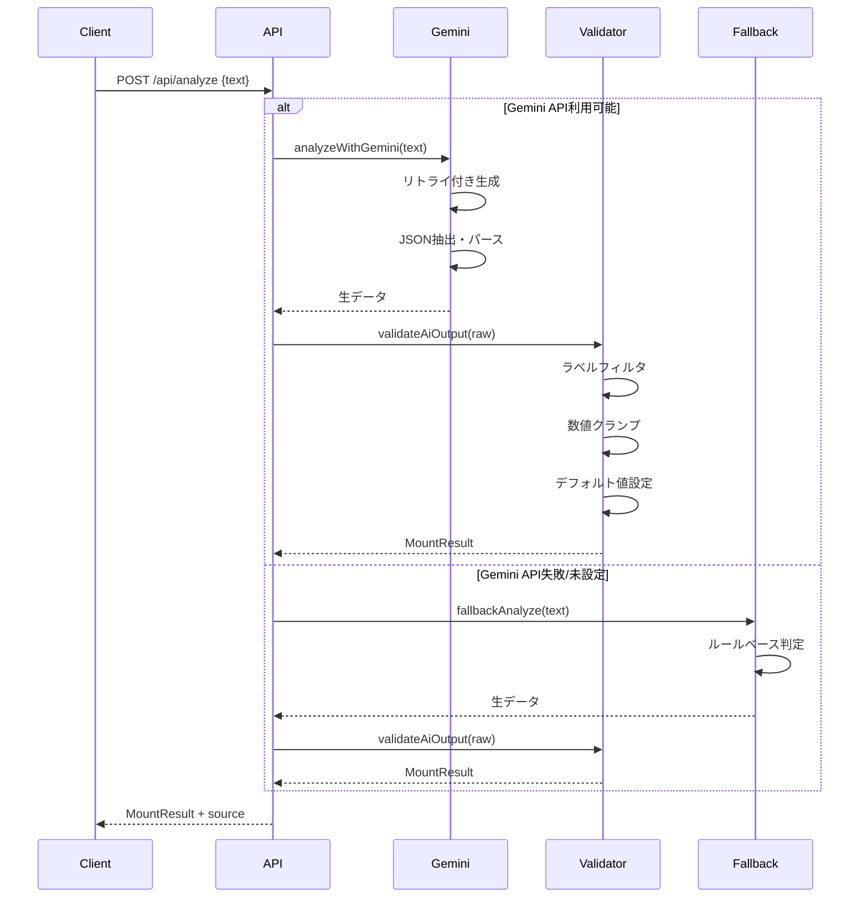

# AI判定システム 詳細仕様書

## 📋 目次

1. [システム概要](#システム概要)
2. [アーキテクチャ](#アーキテクチャ)
3. [スコアリング仕様](#スコアリング仕様)
4. [Gemini API統合](#gemini-api統合)
5. [バリデーション](#バリデーション)
6. [フォールバック判定](#フォールバック判定)
7. [ラベルシステム](#ラベルシステム)
8. [エラーハンドリング](#エラーハンドリング)
9. [パフォーマンス最適化](#パフォーマンス最適化)

---

## システム概要

### 目的

マウンティング発言を定量的に評価し、0〜8848m（エベレストの標高）の数値として可視化する。

### 基本フロー



### 設計原則

1. **安定性優先**: AI出力の不確実性に対応
2. **フォールバック完備**: APIなしでも動作
3. **型安全性**: TypeScriptで厳密な型定義
4. **拡張性**: 新しいラベルやルールの追加が容易

---

## アーキテクチャ

### コンポーネント構成

```
src/lib/analyze/
├── gemini.ts       # Gemini API統合
├── validator.ts    # 出力検証・サニタイズ
└── fallback.ts     # フォールバック判定

src/lib/
└── labels.ts       # ラベル定義

src/app/api/analyze/
└── route.ts        # APIエンドポイント
```

### データフロー詳細



---

## スコアリング仕様

### 基本スコア（mountScore）

**範囲:** 0.0 〜 1.0  
**精度:** 小数点以下2桁推奨

#### スコアの意味

| スコア範囲 | 標高範囲 | 評価 | 説明 |
|-----------|---------|------|------|
| 0.0 - 0.2 | 0 - 1769m | 低 | ほぼマウントなし |
| 0.2 - 0.4 | 1770 - 3539m | 中低 | 軽いマウント |
| 0.4 - 0.6 | 3540 - 5308m | 中 | 明確なマウント |
| 0.6 - 0.8 | 5309 - 7078m | 中高 | 強いマウント |
| 0.8 - 1.0 | 7079 - 8848m | 高 | エベレスト級 |

### 標高計算

```typescript
altitude = Math.round(mountScore * 8848)
```

**最大値:** 8848m（エベレストの標高）  
**最小値:** 0m

### スコア要素

#### 1. 基本要素

- **数値の使用**: 具体的な数字（年収、実績など）
- **比較表現**: 「〜より」「〜以上」など
- **努力アピール**: 「頑張った」「苦労した」など
- **権威付け**: 「〜大学」「〜社」など

#### 2. 高度な要素

- **皮肉**: 遠回しな優越感
- **上から目線**: 説教口調
- **褒めて落とす**: 一見褒めているが実は貶す
- **ゲートキーピング**: 「分かる人には分かる」

---

## Gemini API統合

### ファイル

`src/lib/analyze/gemini.ts`

### モデル設定

```typescript
const model = genAI.getGenerativeModel({
    model: "models/gemini-2.0-flash-lite-001",
    generationConfig: {
        responseMimeType: "application/json",
        temperature: 0.3, // 低温度で安定化
    },
});
```

#### パラメータ解説

| パラメータ | 値 | 理由 |
|-----------|---|------|
| model | gemini-2.0-flash-lite-001 | 高速・低コスト |
| responseMimeType | application/json | JSON出力を強制 |
| temperature | 0.3 | 出力の安定性を重視 |

### プロンプト設計

#### 完全なプロンプト

```
次の文章の「マウンティング度」を判定してください。
必ずJSONのみで出力してください。

# ルール
- mountScore: 0.0〜1.0 (数値)
- labels: 以下の固定ラベルIDのみ使用可能（配列、最大5個）
  - NUMERIC（数値）
  - COMPARISON（比較）
  - EFFORT（努力）
  - AUTHORITY（権威）
  - SARCASM（皮肉）
  - CONDESCENDING（上から目線）
  - BACKHANDED（褒めて落とす）
  - GATEKEEP（分かってる人なら）
- breakdown: 各ラベルの寄与度（0.0〜1.0）とpenalty（任意、-0.0〜-1.0）
- tip: 次に標高を伸ばすための攻略ヒント（1行、80文字以内）
- commentary: 実況コメント（1行、80文字以内）

# 対象の文章
"俺の年収は1000万円だよ"

# 出力スキーマ（必ずこの形式で）
{
  "mountScore": 0.75,
  "labels": ["NUMERIC", "COMPARISON"],
  "breakdown": {
    "NUMERIC": 0.4,
    "COMPARISON": 0.35,
    "penalty": -0.1
  },
  "tip": "具体的な数値を増やすとさらに高得点！",
  "commentary": "数値と比較のコンボが決まった！"
}
```

#### プロンプト設計の意図

1. **固定ラベル指定**: 未知のラベルを防ぐ
2. **JSON強制**: パース失敗を減らす
3. **スキーマ例示**: 期待する出力形式を明示
4. **文字数制限**: UI表示を考慮

### リトライメカニズム

#### 指数バックオフ

```typescript
const MAX_RETRIES = 5;
const INITIAL_WAIT_MS = 600;
const MAX_WAIT_MS = 8000;
const JITTER_MS = 250;

async function generateWithBackoff(model: any, prompt: string, retries = 0) {
    try {
        return await model.generateContent(prompt);
    } catch (error) {
        if (retries >= MAX_RETRIES) throw error;
        
        // 429/503のみリトライ
        if (isRateLimitOrServiceUnavailable(error)) {
            let waitMs = Math.min(INITIAL_WAIT_MS * Math.pow(2, retries), MAX_WAIT_MS);
            waitMs += Math.random() * JITTER_MS; // ジッタ
            
            await wait(waitMs);
            return generateWithBackoff(model, prompt, retries + 1);
        }
        
        throw error;
    }
}
```

#### リトライ対象エラー

- **429 Resource Exhausted**: レート制限
- **503 Service Unavailable**: サービス一時停止

#### 待機時間の計算

| リトライ回数 | 基本待機時間 | ジッタ後 |
|------------|------------|---------|
| 1回目 | 600ms | 600-850ms |
| 2回目 | 1200ms | 1200-1450ms |
| 3回目 | 2400ms | 2400-2650ms |
| 4回目 | 4800ms | 4800-5050ms |
| 5回目 | 8000ms | 8000-8250ms |

### JSON抽出

#### 3段階パース

```typescript
function safeJsonParse<T>(text: string): T {
    // 1. マークダウン記法の除去
    const codeBlockMatch = text.match(/```(?:json)?\s*([\s\S]*?)\s*```/);
    if (codeBlockMatch) {
        try {
            return JSON.parse(codeBlockMatch[1]);
        } catch {}
    }
    
    // 2. 中括弧の抽出
    const firstBrace = text.indexOf("{");
    const lastBrace = text.lastIndexOf("}");
    if (firstBrace !== -1 && lastBrace !== -1) {
        const jsonCandidate = text.substring(firstBrace, lastBrace + 1);
        try {
            return JSON.parse(jsonCandidate);
        } catch {}
    }
    
    // 3. そのままパース
    return JSON.parse(text);
}
```

#### 対応する出力形式

1. **マークダウンコードブロック**
   ```
   ```json
   {"mountScore": 0.5}
   ```
   ```

2. **前後にテキスト付き**
   ```
   解析結果は以下です: {"mountScore": 0.5} です。
   ```

3. **純粋なJSON**
   ```
   {"mountScore": 0.5}
   ```

---

## バリデーション

### ファイル

`src/lib/analyze/validator.ts`

### 検証項目

#### 1. mountScore

```typescript
const mountScore = clamp01(Number(raw.mountScore ?? 0));
```

- **型変換**: 文字列でも数値化
- **範囲制限**: 0.0 〜 1.0
- **デフォルト**: 0

#### 2. labels

```typescript
let labels: LabelId[] = [];
if (Array.isArray(raw.labels)) {
    labels = raw.labels
        .filter((label: any) => typeof label === "string" && isLabelId(label))
        .slice(0, 5); // 最大5個
}
```

**検証ルール:**
- 配列であること
- 各要素が文字列
- 有効な`LabelId`のみ
- 最大5個まで

**除外される例:**
- 未知のラベル（例: "UNKNOWN"）
- 数値や`null`
- 6個目以降

#### 3. breakdown

```typescript
let breakdown: Breakdown = {};
if (typeof raw.breakdown === "object" && raw.breakdown !== null) {
    for (const [key, value] of Object.entries(raw.breakdown)) {
        if (key === "penalty") {
            // penalty は -1.0 〜 0.0
            breakdown.penalty = Math.max(-1.0, Math.min(0.0, Number(value ?? 0)));
        } else if (isLabelId(key)) {
            // ラベルの寄与度は 0.0 〜 1.0
            breakdown[key] = clamp01(Number(value ?? 0));
        }
        // 未知のキーは無視
    }
}
```

**検証ルール:**
- オブジェクトであること
- `penalty`: -1.0 〜 0.0
- ラベル寄与度: 0.0 〜 1.0
- 未知のキーは無視

#### 4. tip / commentary

```typescript
// tip
let tip = "";
if (typeof raw.tip === "string") {
    tip = raw.tip.slice(0, 80).trim();
}
if (!tip) {
    tip = "次回もがんばりましょう！";
}

// commentary
let commentary = "";
if (typeof raw.commentary === "string") {
    commentary = raw.commentary.slice(0, 80).trim();
}
if (!commentary) {
    commentary = "いい感じです！";
}
```

**検証ルール:**
- 文字列であること
- 最大80文字
- 空の場合はデフォルト値

### バリデーション後の型

```typescript
type MountResult = {
    mountScore: number;        // 0.0 〜 1.0
    altitude: number;          // 0 〜 8848
    labels: LabelId[];         // 有効なラベルのみ、最大5個
    breakdown: Breakdown;      // 検証済み
    tip: string;               // 1〜80文字
    commentary: string;        // 1〜80文字
    rewrite?: string;          // オプション（互換性）
};
```

---

## フォールバック判定

### ファイル

`src/lib/analyze/fallback.ts`

### 目的

Gemini APIが利用できない場合でもゲームをプレイ可能にする。

### ルールベース判定

```typescript
export function fallbackAnalyze(text: string): MountResult & { source: string } {
    const mountScore = clamp01(text.length / 60);
    const altitude = Math.round(mountScore * 8848);

    // ラベルを標高に応じて決定
    let labels: LabelId[];
    if (altitude > 6000) {
        labels = ["NUMERIC", "COMPARISON"];
    } else if (altitude > 3000) {
        labels = ["COMPARISON"];
    } else {
        labels = ["EFFORT"];
    }

    // breakdown を生成
    const breakdown: Record<string, number> = {};
    labels.forEach((label, index) => {
        breakdown[label] = 0.3 + (index * 0.1);
    });

    return {
        mountScore,
        altitude,
        labels,
        breakdown,
        tip: "文字数を増やすと標高が上がります！",
        commentary: "fallbackモードで判定しました",
        source: "fallback",
    };
}
```

### スコアリングロジック

#### 文字数ベース

```
mountScore = min(text.length / 60, 1.0)
```

| 文字数 | mountScore | 標高 |
|-------|-----------|------|
| 0-10 | 0.0-0.17 | 0-1504m |
| 11-20 | 0.18-0.33 | 1505-2920m |
| 21-30 | 0.35-0.50 | 3097-4424m |
| 31-40 | 0.52-0.67 | 4601-5929m |
| 41-50 | 0.68-0.83 | 6017-7344m |
| 51-60+ | 0.85-1.0 | 7521-8848m |

#### ラベル割り当て

| 標高 | ラベル |
|------|--------|
| 6001m以上 | NUMERIC, COMPARISON |
| 3001-6000m | COMPARISON |
| 0-3000m | EFFORT |

### 制限事項

- 文章の内容を分析しない
- 文字数のみで判定
- ラベルの種類が少ない
- tip/commentaryが固定

---

## ラベルシステム

### ファイル

`src/lib/labels.ts`

### ラベル定義

```typescript
export type LabelId =
  // コアラベル（ゲーム計算に使用）
  | "NUMERIC"      // 数値
  | "COMPARISON"   // 比較
  | "EFFORT"       // 努力
  // 追加ラベル（演出・分析用）
  | "AUTHORITY"    // 権威
  | "SARCASM"      // 皮肉
  | "CONDESCENDING" // 上から目線
  | "BACKHANDED"   // 褒めて落とす
  | "GATEKEEP";    // 分かってる人なら
```

### コアラベル vs 追加ラベル

#### コアラベル（CORE_LABELS）

```typescript
export const CORE_LABELS: LabelId[] = ["NUMERIC", "COMPARISON", "EFFORT"];
```

**用途:**
- 天候ボーナスの判定
- ゲームロジックでの使用

#### 追加ラベル

**用途:**
- UI表示
- 分析の深化
- 実況コメント

### 日本語マッピング

```typescript
export const LABEL_JA_MAP: Record<LabelId, string> = {
  NUMERIC: "数値",
  COMPARISON: "比較",
  EFFORT: "努力",
  AUTHORITY: "権威",
  SARCASM: "皮肉",
  CONDESCENDING: "上から目線",
  BACKHANDED: "褒めて落とす",
  GATEKEEP: "分かってる人なら",
};

export function getLabelJa(labelId: LabelId): string {
  return LABEL_JA_MAP[labelId] || labelId;
}
```

### ラベルの意味

| ラベルID | 日本語 | 説明 | 例 |
|---------|-------|------|---|
| NUMERIC | 数値 | 具体的な数字を使用 | "年収1000万" |
| COMPARISON | 比較 | 他者との比較 | "〜より上" |
| EFFORT | 努力 | 努力アピール | "頑張った" |
| AUTHORITY | 権威 | 権威付け | "東大卒" |
| SARCASM | 皮肉 | 遠回しな優越感 | "まあ、普通だよね" |
| CONDESCENDING | 上から目線 | 説教口調 | "君も頑張れば」 |
| BACKHANDED | 褒めて落とす | 一見褒めるが貶す | "意外とやるね」 |
| GATEKEEP | 分かってる人なら | 排他的 | "知ってる人には分かる」 |

---

## エラーハンドリング

### エラーの種類

#### 1. Gemini APIエラー

```typescript
try {
    const result = await analyzeWithGemini(text);
    return NextResponse.json({ ...validated, source: "gemini" });
} catch (e) {
    console.error("Gemini analysis failed, switching to fallback:", e);
    // フォールバックへ
}
```

**対応:**
- 自動的にフォールバックに切り替え
- ユーザーには透過的

#### 2. JSONパースエラー

```typescript
try {
    const parsed = safeJsonParse<Partial<GeminiOut>>(textRes);
} catch (error) {
    console.error("JSON parse error:", error);
    throw error; // リトライまたはフォールバック
}
```

**対応:**
- 3段階パースで対応
- 失敗時はリトライ

#### 3. バリデーションエラー

```typescript
// バリデーションは常に成功する設計
// 不正な値はデフォルト値に置き換え
const mountScore = clamp01(Number(raw.mountScore ?? 0));
```

**対応:**
- エラーを投げない
- デフォルト値で補完

### エラーログ

```typescript
console.error("Gemini API Error:", error);
console.warn("Too many in-flight requests. Returning 429 Busy.");
console.warn(`Gemini API 429/503 detected. Retrying... (${retries + 1}/${MAX_RETRIES})`);
```

---

## パフォーマンス最適化

### 同時実行制限

```typescript
let inFlight = 0;
const MAX_CONCURRENT = 1;

export async function POST(req: Request) {
    if (inFlight >= MAX_CONCURRENT) {
        return NextResponse.json(
            { error: "Server Busy (Rate Limit Protection)" },
            { status: 429 }
        );
    }
    
    inFlight++;
    try {
        // 処理...
    } finally {
        inFlight--;
    }
}
```

**目的:**
- Gemini APIのレート制限を回避
- サーバー負荷の軽減

### キャッシュ戦略

現在未実装だが、以下の戦略が考えられる：

#### 1. クライアント側キャッシュ

```typescript
// 同じ入力に対して再判定しない
const cache = new Map<string, MountResult>();

if (cache.has(text)) {
    return cache.get(text);
}
```

#### 2. サーバー側キャッシュ

```typescript
// Redis等を使用
const cached = await redis.get(`mount:${hash(text)}`);
if (cached) {
    return JSON.parse(cached);
}
```

### レスポンスタイム

| フェーズ | 目標時間 | 実測値 |
|---------|---------|--------|
| Gemini API呼び出し | < 2秒 | 1-3秒 |
| バリデーション | < 10ms | 5-10ms |
| Fallback判定 | < 5ms | 1-5ms |
| 合計（Gemini） | < 2.5秒 | 1.5-3.5秒 |
| 合計（Fallback） | < 50ms | 10-50ms |

---

## まとめ

### システムの特徴

1. **堅牢性**: 多段階のエラーハンドリング
2. **安定性**: バリデーションとデフォルト値
3. **可用性**: フォールバック機構
4. **拡張性**: モジュール化された設計

### 今後の改善案

1. **キャッシュ実装**: レスポンスタイム短縮
2. **プロンプト改善**: より正確な判定
3. **ラベル追加**: 分析の深化
4. **A/Bテスト**: プロンプトの最適化

### 関連ドキュメント

- [プロダクト全体概要](./product-overview.md)
- [ソロモード実装](./solo-mode-implementation.md)
- [対戦モード実装](./versus-local-implementation.md)
