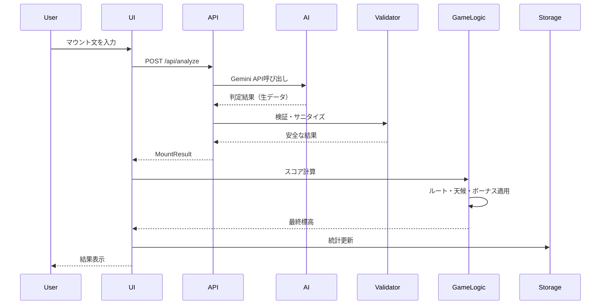
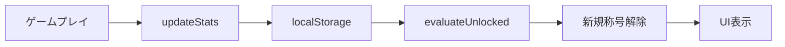

# マウンティングマウンテン プロダクト全体ドキュメント

## 📋 目次

1. [プロダクト概要](#プロダクト概要)
2. [コンセプト](#コンセプト)
3. [アーキテクチャ](#アーキテクチャ)
4. [ゲームモード](#ゲームモード)
5. [ゲームシステム](#ゲームシステム)
6. [AI判定システム](#ai判定システム)
7. [称号システム](#称号システム)
8. [技術スタック](#技術スタック)
9. [ディレクトリ構成](#ディレクトリ構成)
10. [開発ガイド](#開発ガイド)

---

## プロダクト概要

### 🏔 マウンティングマウンテン

**「マウント」を"標高"で可視化するAIゲーム**

日常会話の中に潜む「マウンティング発言」をAIが判定し、標高（m）として表示するコミュニケーションゲームです。

### 基本コンセプト

> 「なんとなく感じるマウント」を、数値で説明できるようにする。

- マウントが強いほど標高が上がる（最高: エベレスト 8848m）
- AIが文章を分析し、マウンティング度をスコアリング
- ラベルでマウントの種類を分類（数値、比較、努力など）
- 攻略ヒントと実況コメントで楽しくプレイ

### ターゲットユーザー

- コミュニケーションに興味がある人
- AIの判定を楽しめる人
- 友人と対戦して盛り上がりたい人
- 自分のマウント癖を客観視したい人

---

## コンセプト

### デザインテーマ: 「頂点を目指せ (Climb to the Top)」

#### コアバリュー

1. **可視化**: 感覚的なものを数値化
2. **遊び心**: 少し意地悪なテーマを親しみやすく
3. **戦略性**: 単なる判定ゲームではなく、戦略的な要素を追加

#### カラーパレット

- **メイン**: `bg-zinc-900` / `text-white`（プレミアム感）
- **アクセント**: `text-blue-500`（高山の空気）
- **アクション**: `bg-red-600`（マウントの警告色）

---

## アーキテクチャ

### システム構成図

```mermaid
graph TB
    subgraph "フロントエンド"
        A[Next.js App Router]
        B[React Components]
        C[Tailwind CSS]
    end
    
    subgraph "バックエンド API"
        D[/api/analyze]
    end
    
    subgraph "AI判定"
        E[Gemini API]
        F[Validator]
        G[Fallback]
    end
    
    subgraph "ゲームロジック"
        H[Score Calculation]
        I[Route System]
        J[Weather System]
        K[Bonus System]
        L[Mission System]
    end
    
    subgraph "データ永続化"
        M[localStorage]
        N[Achievement Store]
    end
    
    A --> B
    B --> D
    D --> E
    E --> F
    F --> H
    D --> G
    G --> F
    H --> I
    H --> J
    H --> K
    H --> L
    B --> M
    M --> N
```

### データフロー



---

## ゲームモード

### 1. ソロモード (`/solo`)

**詳細:** [solo-mode-implementation.md](./solo-mode-implementation.md)

#### 概要
- 3ラウンド制の1人プレイ
- ルート選択、天候、ミッション、ボーナスなど多彩なシステム
- 星評価とサマリーで達成度を可視化

#### 主要機能
- ✅ ルート選択（SAFE/NORMAL/RISKY）
- ✅ 天候システム（SUNNY/WINDY/BLIZZARD）
- ✅ ボーナス計算（ラベル複合）
- ✅ ミッション（3種類）
- ✅ 星評価（★〜★★★）
- ✅ 攻略ヒント・実況コメント

#### ゲームフロー
1. お題・天候・ミッション抽選
2. ルート選択
3. マウント文入力
4. AI判定 → スコア計算
5. 結果表示（3ラウンド繰り返し）
6. ミッション判定 → 星評価

### 2. ローカル対戦モード (`/versus/local`)

**詳細:** [versus-local-implementation.md](./versus-local-implementation.md)

#### 概要
- 同一デバイスで2人が交互にプレイ
- 3ラウンド制、合計標高で勝敗を決定

#### 主要機能
- ✅ ターン制システム
- ✅ リアルタイムスコア表示
- ✅ 対戦履歴
- ✅ 勝者判定

#### 現在の制限
- ❌ ルート選択なし
- ❌ 天候システムなし
- ❌ ボーナス計算なし
- ❌ tip/commentary表示なし

**改善提案:** [versus_mode_evaluation.md](../versus_mode_evaluation.md)

### 3. 称号ページ (`/achievements`)

#### 概要
- プレイ実績に応じて称号を解除
- 統計データの可視化

#### 称号の種類
- 標高関連（雪山、エベレスト）
- プレイ回数
- 対戦成績
- ミッション達成

---

## ゲームシステム

### 1. ルート選択システム

**ファイル:** `src/lib/solo/routes.ts`

| ルート | 倍率 | リスク | 説明 |
|--------|------|--------|------|
| SAFE | ×0.8 | なし | 確実に積む |
| NORMAL | ×1.0 | なし | バランス型 |
| RISKY | ×1.3 | 50%滑落 | 一発逆転 |

**滑落メカニズム:**
- RISKY選択時、50%の確率で標高2000mに固定
- 天候ボーナスも無効化

### 2. 天候システム

**ファイル:** `src/lib/solo/weather.ts`

| 天候 | ブーストラベル | 効果 |
|------|---------------|------|
| 晴天☀ | NUMERIC | 「数値」を含むと+20% |
| 強風💨 | COMPARISON | 「比較」を含むと+20% |
| 吹雪❄ | EFFORT | 「努力」を含むと+20% |

**適用タイミング:**
- ルート倍率適用後
- ボーナス加算前

### 3. ボーナスシステム

**ファイル:** `src/lib/solo/bonus.ts`

| ユニークラベル数 | ボーナス | 理由 |
|----------------|---------|------|
| 4種類以上 | +1200m | 深みのあるマウント |
| 3種類 | +700m | 多角的なマウント |
| 2種類 | +300m | 複合マウント |

### 4. ミッションシステム

**ファイル:** `src/lib/solo/missions.ts`

| ミッション | 目標 | 説明 |
|-----------|------|------|
| 高峰制覇 | 15000m | 合計標高15000m以上 |
| エベレスト級 | 8000m | 1回でも8000m以上 |
| 多角的マウント | 3種類 | 3種類以上のラベル |

### 5. スコア計算フロー

```
AI判定（基本標高 0-8848m）
  ↓
ルート倍率適用（×0.8 / ×1.0 / ×1.3）
  ↓
滑落判定（RISKYのみ、50%で2000m固定）
  ↓
天候ボーナス（該当ラベルで×1.2）
  ↓
ボーナス加算（+300m / +700m / +1200m）
  ↓
最終標高
```

---

## AI判定システム

### アーキテクチャ

```mermaid
graph LR
    A[ユーザー入力] --> B[/api/analyze]
    B --> C{Gemini API利用可能?}
    C -->|Yes| D[Gemini API]
    C -->|No| E[Fallback]
    D --> F[Validator]
    E --> F
    F --> G[MountResult]
```

### 1. Gemini API判定

**ファイル:** `src/lib/analyze/gemini.ts`

#### プロンプト設計

```typescript
const prompt = `
次の文章の「マウンティング度」を判定してください。
必ずJSONのみで出力してください。

# ルール
- mountScore: 0.0〜1.0 (数値)
- labels: 以下の固定ラベルIDのみ使用可能（配列、最大5個）
  - NUMERIC（数値）
  - COMPARISON（比較）
  - EFFORT（努力）
  - AUTHORITY（権威）
  - SARCASM（皮肉）
  - CONDESCENDING（上から目線）
  - BACKHANDED（褒めて落とす）
  - GATEKEEP（分かってる人なら）
- breakdown: 各ラベルの寄与度（0.0〜1.0）とpenalty（任意、-0.0〜-1.0）
- tip: 次に標高を伸ばすための攻略ヒント（1行、80文字以内）
- commentary: 実況コメント（1行、80文字以内）

# 対象の文章
${JSON.stringify(text)}
`;
```

#### 設定

- **モデル:** `gemini-2.0-flash-exp`
- **温度:** `0.3`（安定性重視）
- **リトライ:** 最大3回（指数バックオフ）

### 2. バリデーション

**ファイル:** `src/lib/analyze/validator.ts`

#### 検証項目

1. **ラベルフィルタリング**
   - 未知のラベルを除外
   - 最大5個に制限

2. **数値クランプ**
   - `mountScore`: 0.0〜1.0
   - `breakdown`: 0.0〜1.0
   - `penalty`: -1.0〜0.0

3. **デフォルト値**
   - `tip`: 空なら「次回もがんばりましょう！」
   - `commentary`: 空なら「いい感じです！」

### 3. フォールバック判定

**ファイル:** `src/lib/analyze/fallback.ts`

#### ルールベース判定

```typescript
export function fallbackAnalyze(text: string): MountResult {
    const lower = text.toLowerCase();
    let score = 0.3; // ベーススコア
    const labels: LabelId[] = [];

    // 数値検出
    if (/\d{3,}/.test(text)) {
        score += 0.2;
        labels.push("NUMERIC");
    }

    // 比較表現
    if (/より|以上|超え|勝る/.test(text)) {
        score += 0.15;
        labels.push("COMPARISON");
    }

    // 努力表現
    if (/頑張|努力|苦労/.test(text)) {
        score += 0.1;
        labels.push("EFFORT");
    }

    const altitude = Math.round(score * 8848);

    return {
        mountScore: score,
        altitude,
        labels,
        breakdown: {},
        tip: "Gemini APIを設定するとより正確な判定ができます",
        commentary: "フォールバック判定で分析しました",
    };
}
```

### 4. ラベルシステム（Issue #32）

**ファイル:** `src/lib/labels.ts`

#### ラベル定義

```typescript
export type LabelId =
  // コアラベル（ゲーム計算に使用）
  | "NUMERIC"      // 数値
  | "COMPARISON"   // 比較
  | "EFFORT"       // 努力
  // 追加ラベル（演出・分析用）
  | "AUTHORITY"    // 権威
  | "SARCASM"      // 皮肉
  | "CONDESCENDING" // 上から目線
  | "BACKHANDED"   // 褒めて落とす
  | "GATEKEEP";    // 分かってる人なら

export const LABEL_JA_MAP: Record<LabelId, string> = {
  NUMERIC: "数値",
  COMPARISON: "比較",
  EFFORT: "努力",
  AUTHORITY: "権威",
  SARCASM: "皮肉",
  CONDESCENDING: "上から目線",
  BACKHANDED: "褒めて落とす",
  GATEKEEP: "分かってる人なら",
};
```

---

## 称号システム

**ファイル:** `src/lib/achievementStore.ts`, `src/lib/achievements.ts`

### アーキテクチャ



### 統計データ

```typescript
type AchievementStats = {
    highestAltitude: number;      // 最高標高
    snowCount: number;            // 6000m以上の回数
    everestCount: number;         // 8000m以上の回数
    soloPlays: number;            // ソロプレイ回数
    missionClears: number;        // ミッションクリア回数
    versusPlays: number;          // 対戦プレイ回数
    versusWinsP1: number;         // P1勝利回数
    maxWinMargin: number;         // 最大勝利マージン
};
```

### 称号の種類

| カテゴリ | 称号例 | 条件 |
|---------|--------|------|
| 標高 | 雪山到達 | 6000m以上を1回達成 |
| 標高 | エベレスト級 | 8000m以上を1回達成 |
| プレイ | 初登頂 | ソロモードを1回プレイ |
| ミッション | ミッションマスター | ミッションを10回クリア |
| 対戦 | 対戦デビュー | 対戦モードを1回プレイ |

---

## 技術スタック

### フロントエンド

| 技術 | バージョン | 用途 |
|------|-----------|------|
| Next.js | 16.1.6 | フレームワーク（App Router） |
| React | 19.2.3 | UIライブラリ |
| TypeScript | ^5 | 型安全性 |
| Tailwind CSS | ^4 | スタイリング |
| Framer Motion | ^12.34.0 | アニメーション |
| clsx | ^2.1.1 | クラス名管理 |

### バックエンド

| 技術 | 用途 |
|------|------|
| Next.js API Routes | サーバーレスAPI |
| Gemini API | AI判定 |
| localStorage | データ永続化 |

### 開発ツール

| ツール | 用途 |
|--------|------|
| ESLint | コード品質 |
| TypeScript | 型チェック |

---

## ディレクトリ構成

```
mounting-mountain/
├── docs/                           # ドキュメント
│   ├── product-overview.md         # このファイル
│   ├── solo-mode-implementation.md # ソロモード詳細
│   ├── versus-local-implementation.md # 対戦モード詳細
│   └── design_and_issue.md         # デザインガイド
│
├── src/
│   ├── app/                        # Next.js App Router
│   │   ├── page.tsx                # ランディングページ
│   │   ├── solo/                   # ソロモード
│   │   │   └── page.tsx
│   │   ├── versus/                 # 対戦モード
│   │   │   └── local/
│   │   │       └── page.tsx
│   │   ├── achievements/           # 称号ページ
│   │   │   └── page.tsx
│   │   └── api/                    # API Routes
│   │       └── analyze/
│   │           └── route.ts
│   │
│   ├── components/                 # Reactコンポーネント
│   │   ├── MountainView.tsx        # 山のビジュアル
│   │   └── SoloGameSummary.tsx     # サマリー表示
│   │
│   ├── lib/                        # ビジネスロジック
│   │   ├── analyze/                # AI判定
│   │   │   ├── gemini.ts
│   │   │   ├── validator.ts
│   │   │   └── fallback.ts
│   │   ├── solo/                   # ソロモードロジック
│   │   │   ├── routes.ts
│   │   │   ├── weather.ts
│   │   │   ├── missions.ts
│   │   │   ├── bonus.ts
│   │   │   ├── score.ts
│   │   │   └── summary.ts
│   │   ├── labels.ts               # ラベル定義
│   │   ├── prompts.ts              # お題データ
│   │   ├── game.ts                 # ゲーム共通
│   │   ├── achievements.ts         # 称号定義
│   │   ├── achievementStore.ts     # 称号ストア
│   │   └── utils.ts                # ユーティリティ
│   │
│   └── types/                      # 型定義
│       ├── game.ts
│       └── mount.ts
│
├── package.json
├── tsconfig.json
└── tailwind.config.ts
```

---

## 開発ガイド

### セットアップ

```bash
# 依存関係のインストール
npm install

# 開発サーバー起動
npm run dev

# ビルド
npm run build

# Lint
npm run lint
```

### 環境変数

```bash
# .env.local
GEMINI_API_KEY=your_api_key_here
```

**注意:** Gemini APIキーがなくてもフォールバック判定で動作します。

### コーディング規約

1. **TypeScript必須**
   - すべてのファイルで型定義を使用
   - `any`の使用を避ける

2. **イミュータブルな状態更新**
   ```typescript
   setGame((prev) => {
       const next = structuredClone(prev);
       // 変更...
       return next;
   });
   ```

3. **純関数の使用**
   - ゲームロジックは副作用のない純関数で実装
   - テスト可能性を重視

4. **Tailwind CSS**
   - インラインスタイルで記述
   - レスポンシブ対応（`md:`, `lg:`）
   - ダークモード対応（`dark:`）

### テスト戦略

現在、自動テストは未実装ですが、以下の方針を推奨：

1. **単体テスト**
   - `src/lib/solo/` 配下の純関数
   - `src/lib/analyze/validator.ts`

2. **統合テスト**
   - API Routes（`/api/analyze`）
   - スコア計算フロー全体

3. **E2Eテスト**
   - ソロモードの完全フロー
   - 対戦モードの完全フロー

---

## 今後の拡張予定

### 短期（1-2週間）

- [ ] 対戦モードへのルート選択追加
- [ ] 対戦モードへの天候・ボーナス追加
- [ ] tip/commentary の対戦モード対応

### 中期（1-2ヶ月）

- [ ] オンライン対戦モード
- [ ] ランキング機能
- [ ] 新しいミッションの追加
- [ ] 称号の追加

### 長期（3ヶ月以上）

- [ ] マウント山脈モード（会話ログ解析）
- [ ] カスタムお題作成機能
- [ ] ソーシャル機能（シェア、フレンド）

---

## 関連ドキュメント

- [ソロモード実装詳細](./solo-mode-implementation.md)
- [ローカル対戦モード実装詳細](./versus-local-implementation.md)
- [対戦モードゲーム性評価](../versus_mode_evaluation.md)
- [デザインガイド](./design_and_issue.md)

---

## まとめ

**マウンティングマウンテン**は、AIを活用したユニークなコミュニケーションゲームです。

### 主な特徴

1. **AI判定システム** - Gemini APIによる高精度な分析
2. **多彩なゲームシステム** - ルート、天候、ミッション、ボーナス
3. **戦略性** - 単なる判定ゲームではなく、戦略的な選択が重要
4. **称号システム** - プレイ実績を可視化
5. **拡張性** - モジュール化された設計で新機能追加が容易

### 技術的な強み

- **型安全性** - TypeScriptによる堅牢な実装
- **モジュール化** - 各システムが独立して動作
- **フォールバック** - APIなしでも動作する設計
- **バリデーション** - AI出力の安全性を保証

このプロダクトは、技術とゲームデザインの両面で高い完成度を持ち、今後の拡張にも柔軟に対応できる設計になっています。
