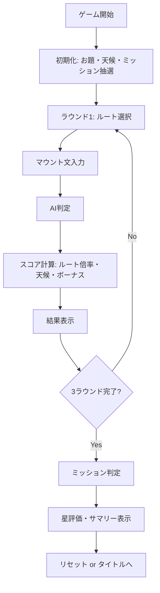
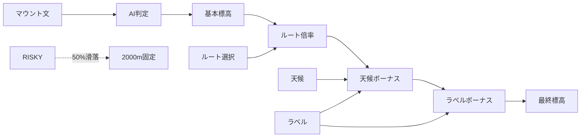
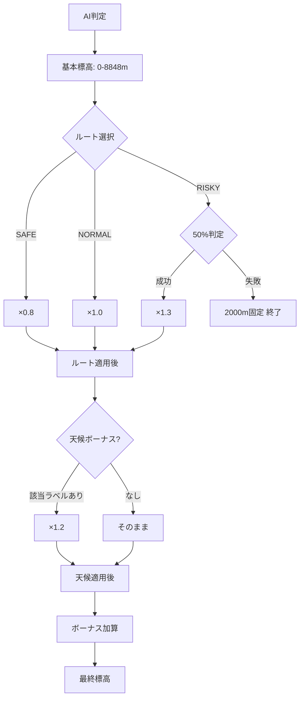

# ソロモード 実装詳細ドキュメント

## 概要

ソロモード（`/solo`）は、1人のプレイヤーが3ラウンドのマウント文を入力し、様々なゲームシステム（ルート選択、天候、ミッション、ボーナス）を駆使して高得点を目指すモードです。

**パス:** `src/app/solo/page.tsx`  
**モード識別子:** `solo`

---

## ゲームフロー

### 基本構造



### ゲームシステムの相互作用



---

## データ構造

### GameState（ソロモード拡張）

```typescript
type GameState = {
    mode: "solo";
    status: "playing" | "finished";
    roundIndex: number; // 0-2
    prompts: string[]; // 3つのお題
    weather: WeatherId; // 天候ID
    mission: Mission; // ミッション
    players: [Player]; // 1人のプレイヤー
};
```

### MountResult（AI判定結果）

```typescript
type MountResult = {
    // 基本情報
    mountScore: number; // 0.0〜1.0
    altitude: number; // 0〜8848m
    labels: LabelId[]; // 固定enum
    
    // 新規フィールド（Issue #32）
    breakdown: Breakdown; // 内訳分析
    tip: string; // 攻略ヒント
    commentary: string; // 実況コメント
    
    // ボーナス情報
    baseAltitude?: number;
    bonusAltitude?: number;
    finalAltitude?: number;
    bonusReasons?: string[];
    
    // ルート情報
    routeId?: RouteId;
    routeMultiplier?: number;
    
    // 滑落情報
    didFall?: boolean;
    fallReason?: string;
    
    // 天候情報
    weatherApplied?: boolean;
    weatherMultiplier?: number;
    weatherBoostLabel?: string;
};
```

---

## 主要ロジック

### 1. ゲーム初期化

```typescript
function initializeSoloGameState(): GameState {
    // お題をランダム選択
    const selectedPrompts = pickN(PROMPTS, ROUND_COUNT).map((p) => p.text);
    const rounds = createRounds(selectedPrompts, ROUND_COUNT);
    
    // 天候とミッションを抽選
    const weather = pickWeather();
    const mission = pickMission();

    return {
        mode: "solo",
        status: "playing",
        roundIndex: 0,
        prompts: rounds.map((r) => r.prompt),
        weather: weather.id,
        mission,
        players: [{
            id: "p1",
            name: "Player 1",
            totalScore: 0,
            rounds,
        }],
    };
}
```

**処理内容:**
1. 3つのお題をランダム選択
2. 天候を1つ抽選（SUNNY/WINDY/BLIZZARD）
3. ミッションを1つ抽選（TOTAL_15000/EVEREST_1/LABELS_3）

### 2. スコア計算フロー

```typescript
async function submitRound() {
    // 1. AI判定
    const result = await fetch("/api/analyze", {
        method: "POST",
        body: JSON.stringify({ text: text.trim() }),
    }).then(res => res.json());

    // 2. ルート取得
    const route = getRoute(round.routeId);

    // 3. ボーナス計算
    const bonus = computeBonus(result.labels);

    // 4. 最終標高計算（ルート倍率・天候・滑落判定）
    const scoreResult = computeFinalAltitude({
        baseAltitude: result.altitude,
        routeId: round.routeId,
        routeMultiplier: route.multiplier,
        bonusAltitude: bonus.bonusAltitude,
        weatherId: game.weather,
        labels: result.labels,
    });

    // 5. 結果を保存
    round.result = {
        ...result,
        baseAltitude: result.altitude,
        bonusAltitude: bonus.bonusAltitude,
        bonusReasons: bonus.reasons,
        finalAltitude: scoreResult.finalAltitude,
        routeId: round.routeId,
        routeMultiplier: route.multiplier,
        didFall: scoreResult.didFall,
        fallReason: scoreResult.fallReason,
        weatherApplied: scoreResult.weatherApplied,
        weatherMultiplier: scoreResult.weatherMultiplier,
        weatherBoostLabel: scoreResult.weatherBoostLabel,
    };

    player.totalScore += scoreResult.finalAltitude;
}
```

---

## ゲームシステム詳細

### 1. ルート選択システム

**ファイル:** `src/lib/solo/routes.ts`

#### ルート定義

| ルートID | 名称 | 倍率 | 説明 | リスク |
|---------|------|------|------|--------|
| SAFE | 安全ルート | ×0.8 | 確実に積む | なし |
| NORMAL | 通常ルート | ×1.0 | バランス型 | なし |
| RISKY | 危険ルート | ×1.3 | 一発逆転 | 50%で滑落 |

#### 実装

```typescript
export const ROUTES: Route[] = [
    {
        id: "SAFE",
        label: "安全ルート",
        multiplier: 0.8,
        description: "確実に積む（×0.8）",
        emoji: "🛡️",
    },
    {
        id: "NORMAL",
        label: "通常ルート",
        multiplier: 1.0,
        description: "バランス型（×1.0）",
        emoji: "⛰️",
    },
    {
        id: "RISKY",
        label: "危険ルート",
        multiplier: 1.3,
        description: "一発逆転（×1.3）",
        emoji: "🔥",
    },
];
```

#### 滑落メカニズム

```typescript
// RISKY選択時、50%の確率で滑落
if (routeId === "RISKY" && rng() < 0.5) {
    return {
        finalAltitude: 2000, // 固定
        didFall: true,
        fallReason: "滑落！",
        weatherApplied: false,
    };
}
```

### 2. 天候システム

**ファイル:** `src/lib/solo/weather.ts`

#### 天候定義

| 天候ID | 名称 | ブーストラベル | 効果 |
|--------|------|---------------|------|
| SUNNY | 晴天 | NUMERIC | 「数値」を含むと+20% |
| WINDY | 強風 | COMPARISON | 「比較」を含むと+20% |
| BLIZZARD | 吹雪 | EFFORT | 「努力」を含むと+20% |

#### 実装

```typescript
export const WEATHERS: Weather[] = [
    {
        id: "SUNNY",
        label: "晴天",
        boostLabel: "NUMERIC",
        emoji: "☀",
        description: "「数値」を含むと+20%",
    },
    {
        id: "WINDY",
        label: "強風",
        boostLabel: "COMPARISON",
        emoji: "💨",
        description: "「比較」を含むと+20%",
    },
    {
        id: "BLIZZARD",
        label: "吹雪",
        boostLabel: "EFFORT",
        emoji: "❄",
        description: "「努力」を含むと+20%",
    },
];
```

#### 天候ボーナス適用

```typescript
if (weatherId) {
    const weather = getWeather(weatherId);
    const hasBoostLabel = labels.includes(weather.boostLabel);

    if (hasBoostLabel) {
        weatherApplied = true;
        weatherMultiplier = 1.2;
        weatherBoostLabel = weather.boostLabel;
        weatherAltitude = Math.round(routeApplied * 1.2);
    }
}
```

### 3. ボーナスシステム

**ファイル:** `src/lib/solo/bonus.ts`

#### ラベル複合ボーナス

| ユニークラベル数 | ボーナス | 理由 |
|----------------|---------|------|
| 4種類以上 | +1200m | 深みのあるマウント |
| 3種類 | +700m | 多角的なマウント |
| 2種類 | +300m | 複合マウント |

#### 実装

```typescript
export function computeBonus(labels: LabelId[]): BonusOut {
    const uniqueLabels = new Set(labels);
    const count = uniqueLabels.size;
    let bonusAltitude = 0;
    const reasons: string[] = [];

    if (count >= 4) {
        bonusAltitude += 1200;
        reasons.push(`深みのあるマウント（4種複合） +1200m`);
    } else if (count >= 3) {
        bonusAltitude += 700;
        reasons.push(`多角的なマウント（3種複合） +700m`);
    } else if (count >= 2) {
        bonusAltitude += 300;
        reasons.push(`複合マウント（2種複合） +300m`);
    }

    return { bonusAltitude, reasons };
}
```

### 4. ミッションシステム

**ファイル:** `src/lib/solo/missions.ts`

#### ミッション定義

| ミッションID | タイトル | 説明 | 目標値 |
|-------------|---------|------|--------|
| TOTAL_15000 | 高峰制覇 | 合計標高15000m以上を達成せよ | 15000 |
| EVEREST_1 | エベレスト級 | 1回でも8000m以上を記録せよ | 8000 |
| LABELS_3 | 多角的マウント | 3種類以上のラベルを出せ | 3 |

#### 実装

```typescript
export const MISSIONS: Mission[] = [
    {
        id: "TOTAL_15000",
        title: "高峰制覇",
        description: "合計標高15000m以上を達成せよ",
        target: 15000,
    },
    {
        id: "EVEREST_1",
        title: "エベレスト級",
        description: "1回でも8000m以上を記録せよ",
        target: 8000,
    },
    {
        id: "LABELS_3",
        title: "多角的マウント",
        description: "3種類以上のラベルを出せ",
        target: 3,
    },
];
```

#### ミッション評価

```typescript
export function evaluateMission(gameState: GameState): MissionProgress {
    const mission = gameState.mission;
    const player = gameState.players[0];

    switch (mission.id) {
        case "TOTAL_15000": {
            const total = player.totalScore;
            const cleared = total >= 15000;
            const ratio = Math.min(total / 15000, 1.0);
            return {
                cleared,
                ratio,
                progressText: `合計: ${total} / 15000m`,
            };
        }
        case "EVEREST_1": {
            const maxAltitude = Math.max(
                ...player.rounds
                    .filter(r => r.result)
                    .map(r => r.result!.finalAltitude || 0)
            );
            const cleared = maxAltitude >= 8000;
            const ratio = Math.min(maxAltitude / 8000, 1.0);
            return {
                cleared,
                ratio,
                progressText: `最高: ${maxAltitude} / 8000m`,
            };
        }
        case "LABELS_3": {
            const allLabels = new Set(
                player.rounds
                    .filter(r => r.result)
                    .flatMap(r => r.result!.labels)
            );
            const count = allLabels.size;
            const cleared = count >= 3;
            const ratio = Math.min(count / 3, 1.0);
            return {
                cleared,
                ratio,
                progressText: `種類: ${count} / 3`,
            };
        }
    }
}
```

### 5. 星評価・サマリーシステム

**ファイル:** `src/lib/solo/summary.ts`

#### 星評価ロジック

```typescript
export function buildSoloSummary(game: GameState): SoloSummary {
    const missionResult = evaluateMission(game);
    
    // 星評価
    let stars: 1 | 2 | 3;
    if (missionResult.cleared) {
        stars = 3; // ★★★
    } else if ((missionResult.ratio || 0) >= 0.8) {
        stars = 2; // ★★
    } else {
        stars = 1; // ★
    }

    return {
        stars,
        mission: missionResult,
        score: { /* ... */ },
        weather: { /* ... */ },
        routes: { /* ... */ },
        falls: /* ... */,
    };
}
```

#### サマリー内容

- **星評価**: ミッション達成度に応じて★〜★★★
- **スコア統計**: 合計、最高、平均
- **天候情報**: 天候とブーストラベル
- **ルート選択**: SAFE/NORMAL/RISKYの回数
- **滑落回数**: RISKYで滑落した回数

---

## UI構成

### 1. ゲーム情報ヘッダー

```tsx
<header>
    <h1>⛰️ ソロモード</h1>
    <div>合計標高: {game.players[0].totalScore}m</div>
    <div>
        {weather.emoji} {weather.label} - {weather.description}
    </div>
</header>
```

### 2. プレイエリア（`status === "playing"`）

```tsx
<section>
    {/* ミッション表示 */}
    <div className="bg-purple-50">
        🎯 ミッション: {mission.title}
        {mission.description}
        {evaluateMission(game).progressText}
    </div>

    {/* お題 */}
    <div>
        <div>Theme</div>
        <div>{currentRound.prompt}</div>
    </div>

    {/* ルート選択 */}
    <div>
        <div>Route</div>
        <div className="flex gap-2">
            {ROUTES.map((route) => (
                <button
                    key={route.id}
                    onClick={() => selectRoute(route.id)}
                    className={isSelected ? "bg-blue-500" : ""}
                >
                    {route.emoji} {route.label}
                    {route.description}
                </button>
            ))}
        </div>
    </div>

    {/* 入力エリア */}
    <textarea
        placeholder="マウント文を入力..."
        value={text}
        onChange={(e) => setText(e.target.value)}
    />

    {/* 送信ボタン */}
    <button onClick={submitRound}>
        {loading ? "判定中..." : "マウント！"}
    </button>
</section>
```

### 3. 結果表示エリア（`lastResult`）

```tsx
<section>
    <h3>Result</h3>

    {/* 山のビジュアル */}
    <MountainView altitude={lastResult.result.finalAltitude} />

    {/* 最終標高 */}
    <div className="text-5xl">
        {lastResult.result.finalAltitude}m
    </div>

    {/* 内訳 */}
    <div>
        <div>基本: {lastResult.result.baseAltitude}m</div>
        {lastResult.result.routeMultiplier !== 1.0 && (
            <div>ルート: ×{lastResult.result.routeMultiplier}</div>
        )}
    </div>

    {/* 滑落警告 */}
    {lastResult.result.didFall && (
        <div className="bg-red-50">
            ⚠️ {lastResult.result.fallReason}
        </div>
    )}

    {/* 天候ボーナス */}
    {lastResult.result.weatherApplied && (
        <div className="bg-blue-50">
            🌤 天候ボーナス発動！「{getLabelJa(lastResult.result.weatherBoostLabel)}」で+20%
        </div>
    )}

    {/* ラベル */}
    <div className="flex gap-2">
        {lastResult.result.labels.map((label) => (
            <span key={label}>{getLabelJa(label)}</span>
        ))}
    </div>

    {/* 攻略ヒント（Issue #32） */}
    {lastResult.result.tip && (
        <div className="bg-blue-50">
            <div>💡 攻略ヒント</div>
            <div>{lastResult.result.tip}</div>
        </div>
    )}

    {/* 実況コメント（Issue #32） */}
    {lastResult.result.commentary && (
        <div className="bg-amber-50">
            <div>🎤 実況</div>
            <div>{lastResult.result.commentary}</div>
        </div>
    )}

    {/* ボーナス理由 */}
    {lastResult.result.bonusReasons?.map((reason) => (
        <div key={reason}>✨ {reason}</div>
    ))}

    {/* 次へボタン */}
    <button onClick={nextRound}>
        {game.roundIndex + 1 < ROUND_COUNT ? "次のラウンドへ" : "結果を見る"}
    </button>
</section>
```

### 4. 終了画面（`status === "finished"`）

```tsx
<section>
    {/* SoloGameSummaryコンポーネント */}
    <SoloGameSummary summary={summary} onReset={resetGame} />
    
    {/* タイトルへ戻るボタン */}
    <Link href="/">タイトルに戻る</Link>
</section>
```

**SoloGameSummary の内容:**
- 星評価（★〜★★★）
- ミッション結果（クリア/失敗）
- 結果サマリー（スコア、天候、ルート、滑落）
- 再挑戦ボタン

---

## スコア計算の詳細フロー



---

## 称号システム連携

### ラウンド毎の統計更新

```typescript
updateStats({
    highestAltitude: scoreResult.finalAltitude,
    snowCount: scoreResult.finalAltitude >= 6000 ? 1 : 0,
    everestCount: scoreResult.finalAltitude >= 8000 ? 1 : 0,
});
```

### ゲーム終了時の統計更新

```typescript
updateStats({
    soloPlays: 1,
    missionClears: missionResult.cleared ? 1 : 0,
});
```

---

## ファイル構成

```
src/app/solo/
└── page.tsx                    # メインコンポーネント（451行）

src/lib/solo/
├── routes.ts                   # ルート定義
├── weather.ts                  # 天候定義
├── missions.ts                 # ミッション定義・評価
├── bonus.ts                    # ボーナス計算
├── score.ts                    # 最終標高計算
└── summary.ts                  # サマリー生成

src/components/
├── SoloGameSummary.tsx         # サマリー表示コンポーネント
└── MountainView.tsx            # 山のビジュアル

src/lib/
├── labels.ts                   # ラベル定義（Issue #32）
└── analyze/
    ├── gemini.ts               # AI判定
    ├── validator.ts            # 出力検証
    └── fallback.ts             # フォールバック
```

---

## 最近の改善（Issue #32）

### 固定ラベルシステム

**変更前:** 自由な日本語ラベル（例: "数値", "比較"）  
**変更後:** 固定enum（`LabelId`）

```typescript
type LabelId = 
  | "NUMERIC" | "COMPARISON" | "EFFORT"
  | "AUTHORITY" | "SARCASM" | "CONDESCENDING" 
  | "BACKHANDED" | "GATEKEEP";
```

### 新規フィールド

1. **breakdown** - 各ラベルの寄与度
2. **tip** - 攻略ヒント（1行）
3. **commentary** - 実況コメント（1行）

### サーバ側バリデーション

- 未知のラベルを除外
- 数値を0-1にclamp
- デフォルト値の設定

---

## 技術的な注意点

### 1. 状態管理

```typescript
// イミュータブルな更新
setGame((prev) => {
    const next = structuredClone(prev);
    // 変更...
    return next;
});
```

### 2. スコア計算の順序

1. AI判定（基本標高）
2. ボーナス計算（ラベル複合）
3. ルート倍率適用
4. 天候ボーナス適用
5. ボーナス加算
6. 最終標高確定

### 3. エラーハンドリング

```typescript
try {
    const res = await fetch("/api/analyze", ...);
    if (!res.ok) {
        const msg = await res.text().catch(() => "");
        throw new Error(`API Error: ${res.status} ${msg}`);
    }
    // ...
} catch (e) {
    setError("判定に失敗しました");
}
```

---

## まとめ

ソロモードは、複数のゲームシステムが相互作用する戦略的なゲームモードです：

- **ルート選択**: リスク/リターンの選択
- **天候システム**: ラベルに応じたボーナス
- **ボーナスシステム**: 多様なマウントを評価
- **ミッションシステム**: 明確な目標設定
- **星評価**: 達成度の可視化

Issue #32により、AI出力が安定化し、攻略ヒントと実況コメントでゲーム体験が向上しました。
