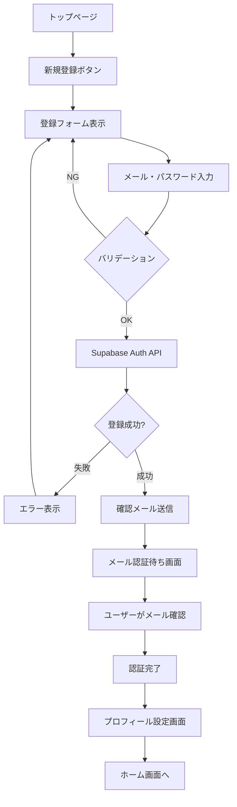
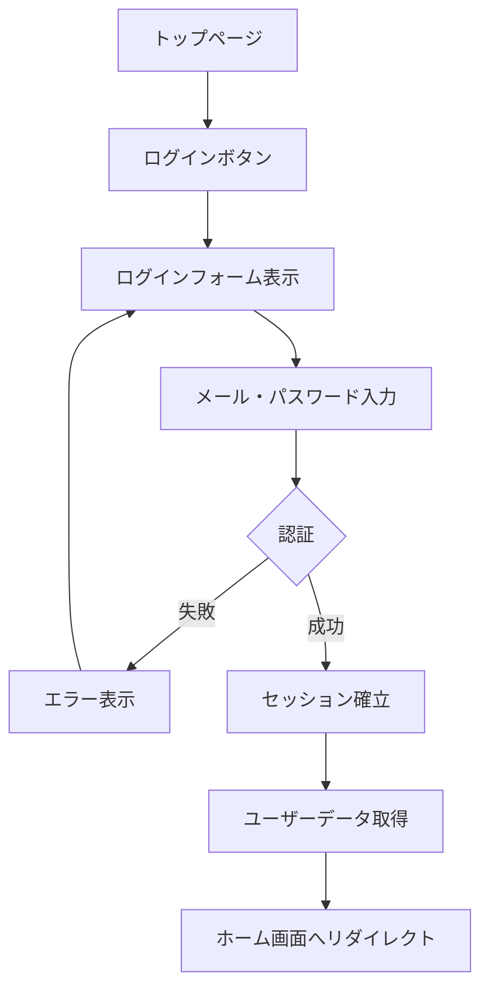
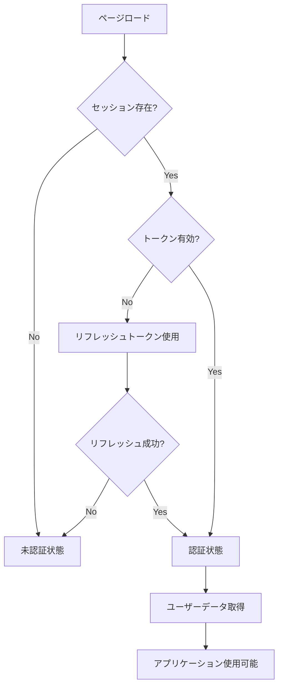

# Supabase ユーザー認証 実装計画書

## 📋 目次

1. [概要](#概要)
2. [目的と背景](#目的と背景)
3. [技術スタック](#技術スタック)
4. [認証フロー設計](#認証フロー設計)
5. [データベース設計](#データベース設計)
6. [実装ステップ](#実装ステップ)
7. [必要なファイル・コンポーネント](#必要なファイルコンポーネント)
8. [セキュリティ考慮事項](#セキュリティ考慮事項)
9. [実装スケジュール](#実装スケジュール)
10. [テスト計画](#テスト計画)

---

## 概要

Supabaseを使用したユーザー認証機能を実装し、以下の機能を実現する：

- ユーザー登録・ログイン・ログアウト
- ユーザープロフィール管理
- ゲームスコアの永続化
- 実績・称号の保存
- プレイ履歴の記録

### 実装スコープ

#### Phase 1: 基本認証機能（MVP）
- [x] Supabaseプロジェクトセットアップ
- [ ] メールアドレス + パスワード認証
- [ ] ログイン/ログアウト機能
- [ ] 認証状態の管理（Context API）
- [ ] プロフィール基本情報の保存

#### Phase 2: プロフィール機能
- [ ] ユーザー名の設定・変更
- [ ] アバター画像のアップロード
- [ ] プロフィール表示画面

#### Phase 3: データ永続化
- [ ] ソロモードスコアの保存
- [ ] ローカル対戦の履歴保存
- [ ] 実績・称号の進捗保存
- [ ] リーダーボード機能

---

## 目的と背景

### 現状の課題

- ゲームプレイデータがブラウザのlocalStorageに依存
- ブラウザを変えると履歴が消える
- デバイス間でデータを共有できない
- 実績システムが永続化されていない
- リーダーボード機能がない

### 実装後のメリット

1. **データの永続化**: スコアや実績がクラウドに保存される
2. **マルチデバイス対応**: どのデバイスからでも自分のデータにアクセス
3. **ソーシャル機能**: リーダーボードで他のプレイヤーと競える
4. **ユーザーエンゲージメント向上**: 継続的なプレイ動機が生まれる
5. **分析可能**: プレイヤーの行動データを分析して改善に活用

---

## 技術スタック

### 認証基盤

- **Supabase Auth**: メール認証、OAuth対応
- **Row Level Security (RLS)**: データベースレベルのアクセス制御

### フロントエンド

- **Next.js 15**: App Router対応
- **React 19**: クライアントコンポーネント
- **TypeScript**: 型安全性
- **Tailwind CSS**: UI/UX

### ライブラリ

```json
{
  "@supabase/supabase-js": "^2.x",
  "@supabase/auth-helpers-nextjs": "^0.x"
}
```

---

## 認証フロー設計

### ユーザー登録フロー



### ログインフロー



### セッション管理フロー



---

## データベース設計

### テーブル構造

#### 1. `profiles` テーブル

ユーザープロフィール情報を保存

```sql
CREATE TABLE profiles (
  id UUID PRIMARY KEY REFERENCES auth.users(id) ON DELETE CASCADE,
  username TEXT UNIQUE,
  display_name TEXT,
  avatar_url TEXT,
  created_at TIMESTAMP WITH TIME ZONE DEFAULT NOW(),
  updated_at TIMESTAMP WITH TIME ZONE DEFAULT NOW()
);

-- RLS有効化
ALTER TABLE profiles ENABLE ROW LEVEL SECURITY;

-- ポリシー: 自分のプロフィールは読み書き可能
CREATE POLICY "Users can view own profile"
  ON profiles FOR SELECT
  USING (auth.uid() = id);

CREATE POLICY "Users can update own profile"
  ON profiles FOR UPDATE
  USING (auth.uid() = id);
```

#### 2. `solo_game_history` テーブル

ソロモードのプレイ履歴

```sql
CREATE TABLE solo_game_history (
  id UUID PRIMARY KEY DEFAULT gen_random_uuid(),
  user_id UUID REFERENCES profiles(id) ON DELETE CASCADE,
  total_altitude INTEGER NOT NULL,
  mission_name TEXT,
  mission_completed BOOLEAN DEFAULT FALSE,
  star_rating INTEGER CHECK (star_rating >= 0 AND star_rating <= 3),
  rounds JSONB NOT NULL, -- ラウンド詳細データ
  weather TEXT,
  played_at TIMESTAMP WITH TIME ZONE DEFAULT NOW()
);

-- インデックス
CREATE INDEX idx_solo_game_history_user_id ON solo_game_history(user_id);
CREATE INDEX idx_solo_game_history_total_altitude ON solo_game_history(total_altitude DESC);

-- RLS有効化
ALTER TABLE solo_game_history ENABLE ROW LEVEL SECURITY;

-- ポリシー
CREATE POLICY "Users can view own game history"
  ON solo_game_history FOR SELECT
  USING (auth.uid() = user_id);

CREATE POLICY "Users can insert own game history"
  ON solo_game_history FOR INSERT
  WITH CHECK (auth.uid() = user_id);
```

#### 3. `versus_game_history` テーブル

ローカル対戦の履歴

```sql
CREATE TABLE versus_game_history (
  id UUID PRIMARY KEY DEFAULT gen_random_uuid(),
  user_id UUID REFERENCES profiles(id) ON DELETE CASCADE,
  player1_name TEXT NOT NULL,
  player2_name TEXT NOT NULL,
  winner TEXT,
  player1_altitude INTEGER NOT NULL,
  player2_altitude INTEGER NOT NULL,
  rounds JSONB NOT NULL,
  played_at TIMESTAMP WITH TIME ZONE DEFAULT NOW()
);

-- インデックス
CREATE INDEX idx_versus_game_history_user_id ON versus_game_history(user_id);

-- RLS有効化
ALTER TABLE versus_game_history ENABLE ROW LEVEL SECURITY;

CREATE POLICY "Users can view own versus history"
  ON versus_game_history FOR SELECT
  USING (auth.uid() = user_id);

CREATE POLICY "Users can insert own versus history"
  ON versus_game_history FOR INSERT
  WITH CHECK (auth.uid() = user_id);
```

#### 4. `achievements` テーブル

ユーザーの実績進捗

```sql
CREATE TABLE user_achievements (
  id UUID PRIMARY KEY DEFAULT gen_random_uuid(),
  user_id UUID REFERENCES profiles(id) ON DELETE CASCADE,
  achievement_id TEXT NOT NULL,
  unlocked_at TIMESTAMP WITH TIME ZONE DEFAULT NOW(),
  progress INTEGER DEFAULT 0,
  UNIQUE(user_id, achievement_id)
);

-- インデックス
CREATE INDEX idx_user_achievements_user_id ON user_achievements(user_id);

-- RLS有効化
ALTER TABLE user_achievements ENABLE ROW LEVEL SECURITY;

CREATE POLICY "Users can view own achievements"
  ON user_achievements FOR SELECT
  USING (auth.uid() = user_id);

CREATE POLICY "Users can update own achievements"
  ON user_achievements FOR ALL
  USING (auth.uid() = user_id);
```

#### 5. `leaderboard_view` ビュー

リーダーボード用の集計ビュー

```sql
CREATE VIEW leaderboard_view AS
SELECT 
  p.id,
  p.username,
  p.display_name,
  p.avatar_url,
  COUNT(sgh.id) as total_games,
  MAX(sgh.total_altitude) as best_altitude,
  AVG(sgh.total_altitude)::INTEGER as avg_altitude,
  SUM(CASE WHEN sgh.mission_completed THEN 1 ELSE 0 END) as missions_completed
FROM profiles p
LEFT JOIN solo_game_history sgh ON p.id = sgh.user_id
GROUP BY p.id, p.username, p.display_name, p.avatar_url
ORDER BY best_altitude DESC;
```

---

## 実装ステップ

### Step 1: Supabaseプロジェクトセットアップ

#### 1.1 Supabaseプロジェクト作成

```bash
# Supabaseにログインしてプロジェクトを作成
# https://supabase.com/dashboard
```

#### 1.2 環境変数設定

`.env.local`に追加:

```env
NEXT_PUBLIC_SUPABASE_URL=your-project-url
NEXT_PUBLIC_SUPABASE_ANON_KEY=your-anon-key
SUPABASE_SERVICE_ROLE_KEY=your-service-role-key
```

#### 1.3 パッケージインストール

```bash
npm install @supabase/supabase-js @supabase/auth-helpers-nextjs
```

### Step 2: Supabaseクライアント設定

#### 2.1 クライアントユーティリティ作成

`src/lib/supabase/client.ts`:

```typescript
import { createClientComponentClient } from '@supabase/auth-helpers-nextjs';
import type { Database } from '@/types/supabase';

export const createClient = () => {
  return createClientComponentClient<Database>();
};
```

#### 2.2 サーバーコンポーネント用

`src/lib/supabase/server.ts`:

```typescript
import { createServerComponentClient } from '@supabase/auth-helpers-nextjs';
import { cookies } from 'next/headers';
import type { Database } from '@/types/supabase';

export const createServerClient = () => {
  return createServerComponentClient<Database>({
    cookies,
  });
};
```

#### 2.3 ルートハンドラー用

`src/lib/supabase/route-handler.ts`:

```typescript
import { createRouteHandlerClient } from '@supabase/auth-helpers-nextjs';
import { cookies } from 'next/headers';
import type { Database } from '@/types/supabase';

export const createRouteClient = () => {
  return createRouteHandlerClient<Database>({
    cookies,
  });
};
```

### Step 3: 認証Context作成

`src/contexts/AuthContext.tsx`:

```typescript
'use client';

import { createContext, useContext, useEffect, useState } from 'react';
import { User } from '@supabase/supabase-js';
import { createClient } from '@/lib/supabase/client';

type AuthContextType = {
  user: User | null;
  loading: boolean;
  signIn: (email: string, password: string) => Promise<void>;
  signUp: (email: string, password: string) => Promise<void>;
  signOut: () => Promise<void>;
};

const AuthContext = createContext<AuthContextType | undefined>(undefined);

export function AuthProvider({ children }: { children: React.ReactNode }) {
  const [user, setUser] = useState<User | null>(null);
  const [loading, setLoading] = useState(true);
  const supabase = createClient();

  useEffect(() => {
    // 初期セッション取得
    supabase.auth.getSession().then(({ data: { session } }) => {
      setUser(session?.user ?? null);
      setLoading(false);
    });

    // 認証状態変更の監視
    const {
      data: { subscription },
    } = supabase.auth.onAuthStateChange((_event, session) => {
      setUser(session?.user ?? null);
    });

    return () => subscription.unsubscribe();
  }, [supabase.auth]);

  const signIn = async (email: string, password: string) => {
    const { error } = await supabase.auth.signInWithPassword({
      email,
      password,
    });
    if (error) throw error;
  };

  const signUp = async (email: string, password: string) => {
    const { error } = await supabase.auth.signUp({
      email,
      password,
    });
    if (error) throw error;
  };

  const signOut = async () => {
    const { error } = await supabase.auth.signOut();
    if (error) throw error;
  };

  return (
    <AuthContext.Provider value={{ user, loading, signIn, signUp, signOut }}>
      {children}
    </AuthContext.Provider>
  );
}

export const useAuth = () => {
  const context = useContext(AuthContext);
  if (context === undefined) {
    throw new Error('useAuth must be used within AuthProvider');
  }
  return context;
};
```

### Step 4: 認証UI実装

#### 4.1 ログインページ

`src/app/auth/login/page.tsx`:

```typescript
'use client';

import { useState } from 'react';
import { useRouter } from 'next/navigation';
import { useAuth } from '@/contexts/AuthContext';
import Link from 'next/link';

export default function LoginPage() {
  const [email, setEmail] = useState('');
  const [password, setPassword] = useState('');
  const [error, setError] = useState('');
  const [loading, setLoading] = useState(false);
  const { signIn } = useAuth();
  const router = useRouter();

  const handleSubmit = async (e: React.FormEvent) => {
    e.preventDefault();
    setError('');
    setLoading(true);

    try {
      await signIn(email, password);
      router.push('/');
    } catch (err) {
      setError('ログインに失敗しました');
    } finally {
      setLoading(false);
    }
  };

  return (
    <div className="min-h-screen flex items-center justify-center bg-gradient-to-b from-sky-400 to-orange-200">
      <div className="bg-white/90 rounded-3xl p-8 shadow-2xl max-w-md w-full">
        <h1 className="text-3xl font-bold text-center mb-8 text-amber-900">
          ログイン
        </h1>

        {error && (
          <div className="bg-red-100 border border-red-400 text-red-700 px-4 py-3 rounded mb-4">
            {error}
          </div>
        )}

        <form onSubmit={handleSubmit} className="space-y-4">
          <div>
            <label className="block text-sm font-bold mb-2 text-gray-700">
              メールアドレス
            </label>
            <input
              type="email"
              value={email}
              onChange={(e) => setEmail(e.target.value)}
              required
              className="w-full px-4 py-3 rounded-lg border-2 border-gray-300 focus:border-amber-500 focus:outline-none"
              placeholder="email@example.com"
            />
          </div>

          <div>
            <label className="block text-sm font-bold mb-2 text-gray-700">
              パスワード
            </label>
            <input
              type="password"
              value={password}
              onChange={(e) => setPassword(e.target.value)}
              required
              className="w-full px-4 py-3 rounded-lg border-2 border-gray-300 focus:border-amber-500 focus:outline-none"
              placeholder="••••••••"
            />
          </div>

          <button
            type="submit"
            disabled={loading}
            className="w-full bg-gradient-to-r from-amber-500 to-orange-500 text-white font-bold py-3 rounded-lg hover:from-amber-600 hover:to-orange-600 transition-all duration-300 disabled:opacity-50"
          >
            {loading ? 'ログイン中...' : 'ログイン'}
          </button>
        </form>

        <div className="mt-6 text-center">
          <Link
            href="/auth/signup"
            className="text-amber-700 hover:text-amber-900 font-semibold"
          >
            新規登録はこちら
          </Link>
        </div>
      </div>
    </div>
  );
}
```

#### 4.2 新規登録ページ

`src/app/auth/signup/page.tsx`:

```typescript
'use client';

import { useState } from 'react';
import { useRouter } from 'next/navigation';
import { useAuth } from '@/contexts/AuthContext';
import Link from 'next/link';

export default function SignUpPage() {
  const [email, setEmail] = useState('');
  const [password, setPassword] = useState('');
  const [confirmPassword, setConfirmPassword] = useState('');
  const [error, setError] = useState('');
  const [loading, setLoading] = useState(false);
  const { signUp } = useAuth();
  const router = useRouter();

  const handleSubmit = async (e: React.FormEvent) => {
    e.preventDefault();
    setError('');

    if (password !== confirmPassword) {
      setError('パスワードが一致しません');
      return;
    }

    if (password.length < 6) {
      setError('パスワードは6文字以上にしてください');
      return;
    }

    setLoading(true);

    try {
      await signUp(email, password);
      router.push('/auth/verify-email');
    } catch (err) {
      setError('登録に失敗しました');
    } finally {
      setLoading(false);
    }
  };

  return (
    <div className="min-h-screen flex items-center justify-center bg-gradient-to-b from-sky-400 to-orange-200">
      <div className="bg-white/90 rounded-3xl p-8 shadow-2xl max-w-md w-full">
        <h1 className="text-3xl font-bold text-center mb-8 text-amber-900">
          新規登録
        </h1>

        {error && (
          <div className="bg-red-100 border border-red-400 text-red-700 px-4 py-3 rounded mb-4">
            {error}
          </div>
        )}

        <form onSubmit={handleSubmit} className="space-y-4">
          <div>
            <label className="block text-sm font-bold mb-2 text-gray-700">
              メールアドレス
            </label>
            <input
              type="email"
              value={email}
              onChange={(e) => setEmail(e.target.value)}
              required
              className="w-full px-4 py-3 rounded-lg border-2 border-gray-300 focus:border-amber-500 focus:outline-none"
              placeholder="email@example.com"
            />
          </div>

          <div>
            <label className="block text-sm font-bold mb-2 text-gray-700">
              パスワード
            </label>
            <input
              type="password"
              value={password}
              onChange={(e) => setPassword(e.target.value)}
              required
              className="w-full px-4 py-3 rounded-lg border-2 border-gray-300 focus:border-amber-500 focus:outline-none"
              placeholder="••••••••"
            />
          </div>

          <div>
            <label className="block text-sm font-bold mb-2 text-gray-700">
              パスワード（確認）
            </label>
            <input
              type="password"
              value={confirmPassword}
              onChange={(e) => setConfirmPassword(e.target.value)}
              required
              className="w-full px-4 py-3 rounded-lg border-2 border-gray-300 focus:border-amber-500 focus:outline-none"
              placeholder="••••••••"
            />
          </div>

          <button
            type="submit"
            disabled={loading}
            className="w-full bg-gradient-to-r from-amber-500 to-orange-500 text-white font-bold py-3 rounded-lg hover:from-amber-600 hover:to-orange-600 transition-all duration-300 disabled:opacity-50"
          >
            {loading ? '登録中...' : '登録'}
          </button>
        </form>

        <div className="mt-6 text-center">
          <Link
            href="/auth/login"
            className="text-amber-700 hover:text-amber-900 font-semibold"
          >
            ログインはこちら
          </Link>
        </div>
      </div>
    </div>
  );
}
```

### Step 5: プロフィール機能

#### 5.1 プロフィール表示・編集ページ

`src/app/profile/page.tsx`:

```typescript
'use client';

import { useState, useEffect } from 'react';
import { useAuth } from '@/contexts/AuthContext';
import { createClient } from '@/lib/supabase/client';
import { useRouter } from 'next/navigation';

type Profile = {
  username: string;
  display_name: string;
  avatar_url: string | null;
};

export default function ProfilePage() {
  const { user, signOut } = useAuth();
  const [profile, setProfile] = useState<Profile | null>(null);
  const [loading, setLoading] = useState(true);
  const [editing, setEditing] = useState(false);
  const router = useRouter();
  const supabase = createClient();

  useEffect(() => {
    if (!user) {
      router.push('/auth/login');
      return;
    }

    fetchProfile();
  }, [user]);

  const fetchProfile = async () => {
    if (!user) return;

    const { data, error } = await supabase
      .from('profiles')
      .select('*')
      .eq('id', user.id)
      .single();

    if (data) {
      setProfile(data);
    }
    setLoading(false);
  };

  const handleUpdate = async (e: React.FormEvent) => {
    e.preventDefault();
    if (!user || !profile) return;

    const { error } = await supabase
      .from('profiles')
      .update(profile)
      .eq('id', user.id);

    if (!error) {
      setEditing(false);
    }
  };

  const handleSignOut = async () => {
    await signOut();
    router.push('/');
  };

  if (loading) {
    return <div>Loading...</div>;
  }

  return (
    <div className="min-h-screen bg-gradient-to-b from-sky-400 to-orange-200 p-8">
      <div className="max-w-2xl mx-auto bg-white/90 rounded-3xl p-8 shadow-2xl">
        <h1 className="text-3xl font-bold mb-8 text-amber-900">プロフィール</h1>

        {editing ? (
          <form onSubmit={handleUpdate} className="space-y-4">
            <div>
              <label className="block text-sm font-bold mb-2">ユーザー名</label>
              <input
                type="text"
                value={profile?.username || ''}
                onChange={(e) =>
                  setProfile({ ...profile!, username: e.target.value })
                }
                className="w-full px-4 py-2 rounded-lg border-2"
              />
            </div>

            <div>
              <label className="block text-sm font-bold mb-2">表示名</label>
              <input
                type="text"
                value={profile?.display_name || ''}
                onChange={(e) =>
                  setProfile({ ...profile!, display_name: e.target.value })
                }
                className="w-full px-4 py-2 rounded-lg border-2"
              />
            </div>

            <div className="flex gap-4">
              <button
                type="submit"
                className="px-6 py-2 bg-amber-500 text-white rounded-lg"
              >
                保存
              </button>
              <button
                type="button"
                onClick={() => setEditing(false)}
                className="px-6 py-2 bg-gray-300 rounded-lg"
              >
                キャンセル
              </button>
            </div>
          </form>
        ) : (
          <div className="space-y-4">
            <div>
              <p className="text-sm text-gray-600">ユーザー名</p>
              <p className="text-xl font-bold">{profile?.username || '未設定'}</p>
            </div>

            <div>
              <p className="text-sm text-gray-600">表示名</p>
              <p className="text-xl font-bold">
                {profile?.display_name || '未設定'}
              </p>
            </div>

            <button
              onClick={() => setEditing(true)}
              className="px-6 py-2 bg-amber-500 text-white rounded-lg"
            >
              編集
            </button>

            <button
              onClick={handleSignOut}
              className="ml-4 px-6 py-2 bg-red-500 text-white rounded-lg"
            >
              ログアウト
            </button>
          </div>
        )}
      </div>
    </div>
  );
}
```

### Step 6: データ保存機能

#### 6.1 ソロモードスコア保存

`src/lib/supabase/saveGameHistory.ts`:

```typescript
import { createClient } from './client';

export async ync function saveSoloGameHistory(data: {
  totalAltitude: number;
  missionName: string;
  missionCompleted: boolean;
  starRating: number;
  rounds: any[];
  weather: string;
}) {
  const supabase = createClient();
  
  const { data: user } = await supabase.auth.getUser();
  if (!user.user) throw new Error('Not authenticated');

  const { error } = await supabase
    .from('solo_game_history')
    .insert({
      user_id: user.user.id,
      total_altitude: data.totalAltitude,
      mission_name: data.missionName,
      mission_completed: data.missionCompleted,
      star_rating: data.starRating,
      rounds: data.rounds,
      weather: data.weather,
    });

  if (error) throw error;
}
```

---

## 必要なファイル・コンポーネント

### ディレクトリ構造

```
src/
├── app/
│   ├── auth/
│   │   ├── login/
│   │   │   └── page.tsx          # ログインページ
│   │   ├── signup/
│   │   │   └── page.tsx          # 新規登録ページ
│   │   ├── verify-email/
│   │   │   └── page.tsx          # メール確認待ち画面
│   │   └── callback/
│   │       └── route.ts          # OAuth コールバック
│   ├── profile/
│   │   └── page.tsx              # プロフィールページ
│   └── leaderboard/
│       └── page.tsx              # リーダーボード
├── contexts/
│   └── AuthContext.tsx           # 認証Context
├── lib/
│   └── supabase/
│       ├── client.ts             # クライアント用
│       ├── server.ts             # サーバーコンポーネント用
│       ├── route-handler.ts     # ルートハンドラー用
│       └── saveGameHistory.ts   # ゲーム履歴保存
├── types/
│   └── supabase.ts               # Supabaseの型定義
└── middleware.ts                 # 認証ミドルウェア
```

---

## セキュリティ考慮事項

### 1. Row Level Security (RLS)

- すべてのテーブルでRLSを有効化
- ユーザーは自分のデータのみアクセス可能
- 公開データ（リーダーボード）は適切なポリシーで制御

### 2. 環境変数の管理

- `.env.local`をgitignoreに追加
- 本番環境では環境変数を安全に管理
- ANON KEYのみクライアントに公開

### 3. トークン管理

- アクセストークンは短期間（1時間）
- リフレッシュトークンで自動更新
- ログアウト時にトークンを破棄

### 4. バリデーション

- クライアント・サーバー両方でバリデーション
- SQLインジェクション対策（SupabaseのORMで自動対応）
- XSS対策（Reactのエスケープ機能）

### 5. メール認証

- 初回登録時はメール確認必須
- パスワードリセット機能の実装

---

## 実装スケジュール

### Week 1: 基盤構築
- Day 1-2: Supabaseセットアップ、データベース設計
- Day 3-4: 認証Context実装
- Day 5: 基本的な認証UI（ログイン/登録）

### Week 2: プロフィール機能
- Day 1-2: プロフィール表示・編集機能
- Day 3-4: アバター画像アップロード
- Day 5: 既存機能との統合開始

### Week 3: データ永続化
- Day 1-2: ソロモードスコア保存機能
- Day 3-4: ローカル対戦履歴保存
- Day 5: 実績システムとの統合

### Week 4: リーダーボード
- Day 1-2: リーダーボードAPI実装
- Day 3-4: リーダーボードUI
- Day 5: テスト・バグ修正

---

## テスト計画

### ユニットテスト

```typescript
// src/lib/supabase/__tests__/auth.test.ts
describe('Authentication', () => {
  it('should sign up a new user', async () => {
    // テストコード
  });

  it('should sign in with valid credentials', async () => {
    // テストコード
  });

  it('should fail with invalid credentials', async () => {
    // テストコード
  });
});
```

### 統合テスト

- ユーザー登録→ログイン→プロフィール設定の一連の流れ
- ゲームプレイ→スコア保存→リーダーボード反映
- ログアウト→再ログイン→データ保持確認

### E2Eテスト（Playwright）

```typescript
test('complete user journey', async ({ page }) => {
  // 新規登録
  await page.goto('/auth/signup');
  await page.fill('input[type="email"]', 'test@example.com');
  await page.fill('input[type="password"]', 'password123');
  await page.click('button[type="submit"]');

  // ゲームプレイ
  await page.goto('/solo');
  // ...

  // スコア確認
  await page.goto('/profile');
  // ...
});
```

---

## 参考リンク

- [Supabase Documentation](https://supabase.com/docs)
- [Supabase Auth Helpers for Next.js](https://supabase.com/docs/guides/auth/auth-helpers/nextjs)
- [Row Level Security](https://supabase.com/docs/guides/auth/row-level-security)
- [Next.js App Router](https://nextjs.org/docs/app)

---

## 更新履歴

| 日付 | バージョン | 変更内容 |
|------|-----------|---------|
| 2026-02-21 | 1.0.0 | 初版作成 |

