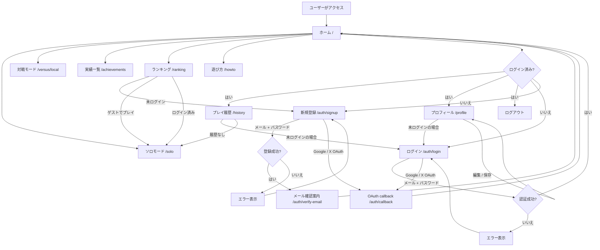
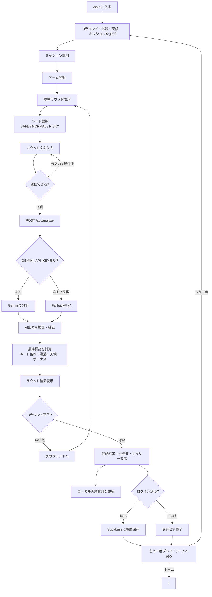
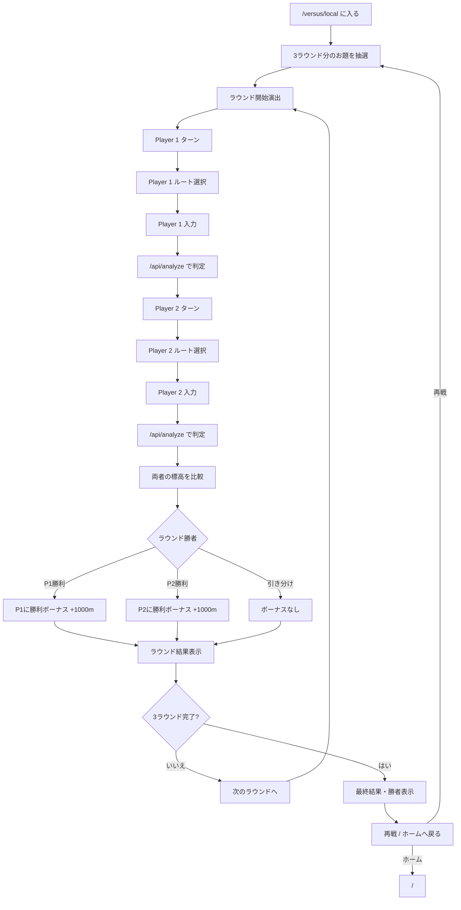
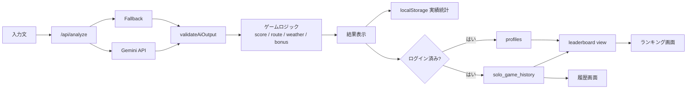

# マウンティングマウンテン ユーザーフロー

このドキュメントは、現在の Next.js App Router 実装をもとにしたユーザー導線の整理です。

## 全体フロー

## ソロモード

## ローカル対戦モード

## データ・保存フロー

## 画面別の主目的

| 画面 | 主目的 | ログイン要否 |
| --- | --- | --- |
| `/` | モード選択、認証導線、主要ページへの入口 | 不要 |
| `/solo` | 3ラウンド制ソロプレイ | 不要 |
| `/versus/local` | 同一端末での2人対戦 | 不要 |
| `/ranking` | 最高スコアランキング表示 | 不要 |
| `/achievements` | 実績一覧の確認 | 不要 |
| `/howto` | 遊び方の確認 | 不要 |
| `/history` | 自分のソロプレイ履歴確認 | 必須 |
| `/profile` | 表示名・ランキング表示設定の編集 | 必須 |
| `/auth/login` | ログイン | 不要 |
| `/auth/signup` | 新規登録 | 不要 |
| `/auth/verify-email` | メール確認案内 | 不要 |
