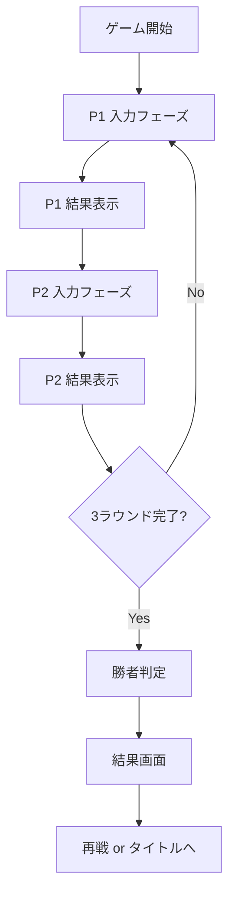
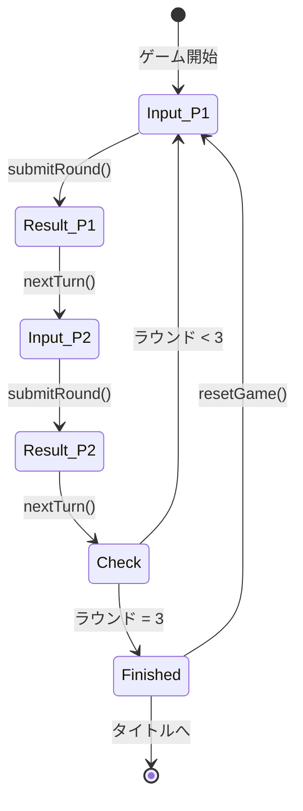

# ローカル対戦モード 実装詳細ドキュメント

## 概要

ローカル対戦モード（`/versus/local`）は、同一デバイス上で2人のプレイヤーが交互にマウント文を入力して対戦するモードです。

**パス:** `src/app/versus/local/page.tsx`  
**モード識別子:** `versus_local`

---

## ゲームフロー

### 基本構造



### フェーズ管理

ゲームは3つのフェーズで管理されます：

1. **`input`** - プレイヤーがマウント文を入力
2. **`result`** - 判定結果を表示（次のターンへの遷移待ち）
3. **`finished`** - ゲーム終了（勝者発表）

---

## データ構造

### VersusState型

```typescript
type VersusState = GameState & {
    currentPlayerIndex: 0 | 1; // 現在のプレイヤー（0: P1, 1: P2）
    phase: "input" | "result" | "finished"; // 現在のフェーズ
    lastResult: Round | undefined; // 直近の判定結果（結果表示用）
};
```

### GameState（共通）

```typescript
type GameState = {
    mode: "versus_local";
    roundIndex: number; // 現在のラウンド（0-based）
    prompts: string[]; // お題リスト
    players: Player[]; // 2人のプレイヤー
    status: "playing" | "finished";
};
```

### Player

```typescript
type Player = {
    id: string; // "p1" or "p2"
    name: string; // "Player 1" or "Player 2"
    totalScore: number; // 合計標高
    rounds: Round[]; // 各ラウンドの結果
};
```

---

## 主要ロジック

### 1. ゲーム初期化（`useEffect`）

```typescript
useEffect(() => {
    const selectedPrompts = pickN(PROMPTS, ROUND_COUNT).map((p) => p.text);
    const roundsP1 = createRounds(selectedPrompts, ROUND_COUNT);
    const roundsP2 = createRounds(selectedPrompts, ROUND_COUNT);

    setGame({
        mode: "versus_local",
        status: "playing",
        roundIndex: 0,
        prompts: selectedPrompts,
        currentPlayerIndex: 0, // P1から開始
        phase: "input",
        players: [
            { id: "p1", name: "Player 1", totalScore: 0, rounds: roundsP1 },
            { id: "p2", name: "Player 2", totalScore: 0, rounds: roundsP2 },
        ],
        lastResult: undefined,
    });
}, []);
```

**処理内容:**
- 3つのお題をランダム選択
- 両プレイヤーに同じお題を割り当て
- P1から開始（`currentPlayerIndex: 0`）

### 2. ラウンド送信（`submitRound`）

```typescript
async function submitRound() {
    // 1. API呼び出し
    const res = await fetch("/api/analyze", {
        method: "POST",
        headers: { "Content-Type": "application/json" },
        body: JSON.stringify({ text: text.trim() }),
    });
    const result = await res.json();

    // 2. 状態更新
    setGame((prev) => {
        const next = structuredClone(prev);
        const player = next.players[next.currentPlayerIndex];
        const round = player.rounds[next.roundIndex];

        // 結果保存
        round.inputText = text.trim();
        round.result = result;
        player.totalScore += result.altitude;

        // 称号判定
        updateStats({
            highestAltitude: result.altitude,
            snowCount: result.altitude >= 6000 ? 1 : 0,
            everestCount: result.altitude >= 8000 ? 1 : 0,
        });

        // 結果表示フェーズへ
        next.lastResult = structuredClone(round);
        next.phase = "result";

        return next;
    });
}
```

**処理内容:**
1. `/api/analyze` でマウント文を判定
2. 結果を現在のプレイヤーのラウンドに保存
3. 合計スコアに加算
4. 称号システムに統計を送信
5. フェーズを`result`に変更

### 3. ターン遷移（`nextTurn`）

```typescript
function nextTurn() {
    setGame((prev) => {
        const next = structuredClone(prev);

        if (next.currentPlayerIndex === 0) {
            // P1終了 → P2へ（同じラウンド）
            next.currentPlayerIndex = 1;
            next.phase = "input";
            next.lastResult = undefined;
        } else {
            // P2終了 → 次のラウンドまたは終了
            if (next.roundIndex + 1 >= ROUND_COUNT) {
                // ゲーム終了
                next.status = "finished";
                next.phase = "finished";

                // 勝者判定と称号更新
                const p1Score = next.players[0].totalScore;
                const p2Score = next.players[1].totalScore;
                const margin = Math.abs(p1Score - p2Score);
                const p1Win = p1Score > p2Score;

                updateStats({
                    versusPlays: 1,
                    versusWinsP1: p1Win ? 1 : 0,
                    maxWinMargin: margin,
                });
            } else {
                // 次のラウンドへ
                next.roundIndex += 1;
                next.currentPlayerIndex = 0; // P1に戻る
                next.phase = "input";
                next.lastResult = undefined;
            }
        }
        return next;
    });
}
```

**処理内容:**
- **P1のターン後:** P2に切り替え（同じラウンド）
- **P2のターン後:** 
  - 3ラウンド未満 → 次のラウンドのP1へ
  - 3ラウンド完了 → ゲーム終了

---

## UI構成

### 1. ヘッダー（スコア表示）

```tsx
<div className="flex justify-between items-center">
    <div className={clsx("p-2 rounded", 
        game.currentPlayerIndex === 0 && "bg-red-500 text-white")}>
        <div>P1</div>
        <div>{game.players[0].totalScore}m</div>
    </div>
    <div>Round {game.roundIndex + 1}/3</div>
    <div className={clsx("p-2 rounded", 
        game.currentPlayerIndex === 1 && "bg-blue-500 text-white")}>
        <div>P2</div>
        <div>{game.players[1].totalScore}m</div>
    </div>
</div>
```

**特徴:**
- 現在のプレイヤーをハイライト（P1: 赤、P2: 青）
- リアルタイムスコア表示
- ラウンド進行状況

### 2. 入力フェーズ（`phase === "input"`）

```tsx
<section>
    {/* プレイヤー名表示 */}
    <div className={currentPlayerIndex === 0 ? "bg-red-500" : "bg-blue-500"}>
        {currentPlayer.name} のターン
    </div>

    {/* お題表示 */}
    <div>
        <div>Theme</div>
        <div>{currentRound.prompt}</div>
    </div>

    {/* 入力エリア */}
    <textarea
        placeholder={`${currentPlayer.name} のマウントを入力...`}
        value={text}
        onChange={(e) => setText(e.target.value)}
    />

    {/* 送信ボタン */}
    <button onClick={submitRound} disabled={!text.trim() || loading}>
        {loading ? "判定中..." : "マウント！"}
    </button>
</section>
```

### 3. 結果表示フェーズ（`phase === "result"`）

```tsx
<section>
    <h3>Judgment</h3>

    {/* 山のビジュアル */}
    <MountainView altitude={lastResult.result.altitude} size={200} />

    {/* 標高 */}
    <div>{lastResult.result.altitude}m</div>

    {/* ラベル */}
    <div>
        {lastResult.result.labels.map(l => (
            <span>{l}</span>
        ))}
    </div>

    {/* 言い換え */}
    <div>
        <div>言い換え</div>
        {lastResult.result.rewrite}
    </div>

    {/* 次へボタン */}
    <button onClick={nextTurn}>
        次は {currentPlayerIndex === 0 ? "Player 2" : "次のラウンド"} へ
    </button>
</section>
```

### 4. 終了画面（`phase === "finished"`）

```tsx
<section>
    <h2>WINNER</h2>

    {/* 勝者表示 */}
    <div>
        {players[0].totalScore > players[1].totalScore ? "🏆 Player 1" :
         players[1].totalScore > players[0].totalScore ? "🏆 Player 2" : 
         "🤝 DRAW"}
    </div>

    {/* スコア */}
    <div>
        <div>Player 1: {players[0].totalScore}m</div>
        <div>Player 2: {players[1].totalScore}m</div>
    </div>

    {/* アクション */}
    <button onClick={resetGame}>再戦する</button>
    <Link href="/">タイトルに戻る</Link>
</section>
```

### 5. 対戦履歴（折りたたみ可能）

```tsx
<section>
    <button onClick={() => setIsHistoryOpen(!isHistoryOpen)}>
        📜 対戦履歴
    </button>

    {isHistoryOpen && (
        <div>
            {Array.from({ length: ROUND_COUNT }).map((_, i) => {
                const r1 = players[0].rounds[i];
                const r2 = players[1].rounds[i];
                return (
                    <div key={i}>
                        <div>Round {i + 1}</div>
                        <div className="grid grid-cols-2 gap-2">
                            {/* P1の結果 */}
                            <div>
                                <div>Player 1</div>
                                {r1?.result && (
                                    <>
                                        <div>{r1.result.altitude}m</div>
                                        <div>{r1.inputText}</div>
                                    </>
                                )}
                            </div>
                            {/* P2の結果 */}
                            <div>
                                <div>Player 2</div>
                                {r2?.result && (
                                    <>
                                        <div>{r2.result.altitude}m</div>
                                        <div>{r2.inputText}</div>
                                    </>
                                )}
                            </div>
                        </div>
                    </div>
                );
            })}
        </div>
    )}
</section>
```

---

## 状態遷移図



---

## API連携

### エンドポイント

**`POST /api/analyze`**

**リクエスト:**
```json
{
  "text": "俺の年収は1000万円だよ"
}
```

**レスポンス:**
```json
{
  "mountScore": 0.75,
  "altitude": 6636,
  "labels": ["NUMERIC", "COMPARISON"],
  "breakdown": {
    "NUMERIC": 0.4,
    "COMPARISON": 0.35
  },
  "tip": "具体的な数値を増やすとさらに高得点！",
  "commentary": "数値と比較のコンボが決まった！",
  "source": "gemini"
}
```

---

## 称号システム連携

### ラウンド毎の統計更新

```typescript
updateStats({
    highestAltitude: result.altitude,
    snowCount: result.altitude >= 6000 ? 1 : 0,
    everestCount: result.altitude >= 8000 ? 1 : 0,
});
```

### ゲーム終了時の統計更新

```typescript
updateStats({
    versusPlays: 1,
    versusWinsP1: p1Win ? 1 : 0,
    maxWinMargin: margin,
});
```

**対応する称号:**
- 対戦プレイ回数
- P1勝利回数
- 最大勝利マージン

---

## 現在の制限事項

### 実装されていない機能

1. **ルート選択** - SAFE/NORMAL/RISKYの選択肢なし
2. **天候システム** - 天候によるボーナスなし
3. **ボーナス計算** - ラベル複合ボーナスなし
4. **ミッション** - 勝利条件の多様化なし
5. **tip/commentary表示** - Issue #32の新機能が未適用

### UI/UX上の課題

1. **ラベル表示** - 英語ID（`NUMERIC`）のまま表示される可能性
2. **盛り上がり不足** - 実況コメントがない
3. **戦略性の浅さ** - リスク/リターンの選択肢がない

---

## 改善提案

詳細は `versus_mode_evaluation.md` を参照。

### 優先度: 高

1. **ルート選択の追加** - ソロモードのUIを流用
2. **tip/commentary表示** - 結果フェーズに追加
3. **ラベルの日本語化** - `getLabelJa()`を使用

### 優先度: 中

4. **ボーナス計算** - `computeBonus()`を適用
5. **非対称お題** - プレイヤーごとに異なるお題

---

## 技術的な注意点

### 1. 状態管理

- `structuredClone()`で深いコピーを作成
- イミュータブルな更新パターン

### 2. フェーズ管理

- `phase`と`currentPlayerIndex`の組み合わせで状態を管理
- 明確な状態遷移ロジック

### 3. エラーハンドリング

```typescript
try {
    const res = await fetch("/api/analyze", ...);
    if (!res.ok) throw new Error("API Error");
    // ...
} catch (e) {
    setError("判定に失敗しました");
}
```

---

## ファイル構成

```
src/app/versus/local/
└── page.tsx          # メインコンポーネント（345行）

依存ファイル:
- src/types/game.ts   # 型定義
- src/lib/prompts.ts  # お題データ
- src/lib/random.ts   # ランダム選択
- src/lib/game.ts     # ラウンド生成
- src/lib/achievementStore.ts # 称号システム
- src/components/MountainView.tsx # 山のビジュアル
```

---

## まとめ

ローカル対戦モードは、シンプルなターン制対戦システムとして実装されています。基本的な対戦の流れは完成していますが、ソロモードにある戦略的要素（ルート選択、天候、ボーナス）が未実装のため、改善の余地があります。

次のステップとして、ルート選択とtip/commentary表示を追加することで、ゲーム性を大幅に向上させることができます。
